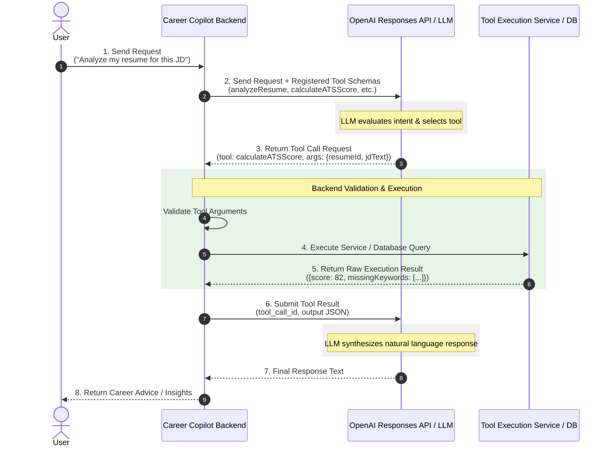

┌──────────────┐
│  1. User     │  Sends natural language prompt: "Compare my resume with this job description"
└──────┬───────┘
       │
       ▼
┌──────────────┐
│  2. Backend  │  • Intercepts user request & extracts session context
│              │  • Injects system prompt & registered JSON Tool Schemas
└──────┬───────┘
       │
       ▼
┌──────────────┐
│  3. OpenAI   │  • Model parses prompt and matches intent against Tool Schemas
│  Responses   │  • Output: Requests function call `calculateATSScore(resumeId, jobDescription)`
│     API      │    (No code is executed inside the LLM)
└──────┬───────┘
       │
       ▼
┌──────────────┐
│  4. Backend  │  • Validates tool arguments against schema definitions
│ (Execution)  │  • Authorizes user request & calls internal services/APIs
│              │  • Tool Result: `{ atsScore: 84, gaps: ["Docker", "Kubernetes"] }`
└──────┬───────┘
       │
       ▼
┌──────────────┐
│  5. OpenAI   │  • Receives tool output payload with matching `tool_call_id`
│  Responses   │  • Generates final conversational response integrating execution data
└──────┬───────┘
       │
       ▼
┌──────────────┐
│  6. User     │  Receives tailored analysis: "Your ATS score is 84%. To boost it, add..."
└──────────────┘

Here is the complete Function Calling workflow design for the **Career Copilot** application, including both a visual sequence diagram and a detailed text-based execution architecture.

---

## 1. Sequence Diagram



---

## 2. Text-Based Architecture Diagram

```text
┌──────────────┐
│  1. User     │  Sends natural language prompt: "Compare my resume with this job description"
└──────┬───────┘
       │
       ▼
┌──────────────┐
│  2. Backend  │  • Intercepts user request & extracts session context
│   (Copilot)  │  • Injects system prompt & registered JSON Tool Schemas
└──────┬───────┘
       │
       ▼
┌──────────────┐
│  3. OpenAI   │  • Model parses prompt and matches intent against Tool Schemas
│  Responses   │  • Output: Requests function call `calculateATSScore(resumeId, jobDescription)`
│     API      │    (No code is executed inside the LLM)
└──────┬───────┘
       │
       ▼
┌──────────────┐
│  4. Backend  │  • Validates tool arguments against schema definitions
│ (Execution)  │  • Authorizes user request & calls internal services/APIs
│              │  • Tool Result: `{ atsScore: 84, gaps: ["Docker", "Kubernetes"] }`
└──────┬───────┘
       │
       ▼
┌──────────────┐
│  5. OpenAI   │  • Receives tool output payload with matching `tool_call_id`
│  Responses   │  • Generates final conversational response integrating execution data
└──────┬───────┘
       │
       ▼
┌──────────────┐
│  6. User     │  Receives tailored analysis: "Your ATS score is 84%. To boost it, add..."
└──────────────┘

```

---

## 3. Workflow Phase Breakdown

1. **User Request:** The user provides input via the frontend UI (e.g., asking for an ATS evaluation or skill gap analysis).
2. **Backend Orchestration:** The backend fetches user context, attaches available tool schemas (JSON Schema), and invokes the OpenAI Responses API (`/v1/chat/completions` or `/v1/responses`).
3. **LLM Tool Call Generation:** The LLM inspects the prompt and tool descriptions. Instead of generating a final text response, it returns `finish_reason: "tool_calls"` along with function names and generated arguments.
4. **Tool Execution:** The backend receives the function call request, validates the parameter payload, executes internal business logic (database lookups, parsing engines, score calculators), and captures the execution result.
5. **Tool Result Submission:** The backend appends the tool response message (`role: "tool"`, `tool_call_id`) back into the conversation thread and re-calls the OpenAI API.
6. **Final Response Generation:** The LLM uses the tool results to construct the final natural language answer and streams/returns it back to the user.

---

## 4. Assignment Questions Answered

### 1. Why does the backend remain in control?

The LLM is a reasoning engine, not a deterministic execution runtime. Keeping the backend in control ensures security, authorization, argument validation, rate-limiting, and error handling. The LLM suggests *intent* and *arguments*, but the backend dictates *what runs*, *who can run it*, and *how side effects are applied*.

### 2. What could go wrong if the LLM executed tools directly?

* **Security & Injection Risks:** Prompt injection attacks could trick the model into dropping database tables, deleting user profiles, or leaking sensitive personal identifiable information (PII).
* **Unvalidated Mutations:** Models can output hallucinated or invalid parameters that corrupt application state.
* **Lack of Access Control:** The LLM cannot perform robust session-based authorization or enforce tenant isolation.

### 3. How would you handle a tool failure?

* **Graceful Degradation:** Catch execution exceptions inside the backend and send a structured error object back to the model (e.g., `{"status": "error", "message": "Resume parsing timeout"}`).
* **Model Self-Correction:** When the model sees the error payload, it can either inform the user gracefully or attempt an alternative path.
* **Circuit Breakers & Retries:** Implement exponential backoff for transient API dependencies, and set hard fallback defaults if a service fails completely.